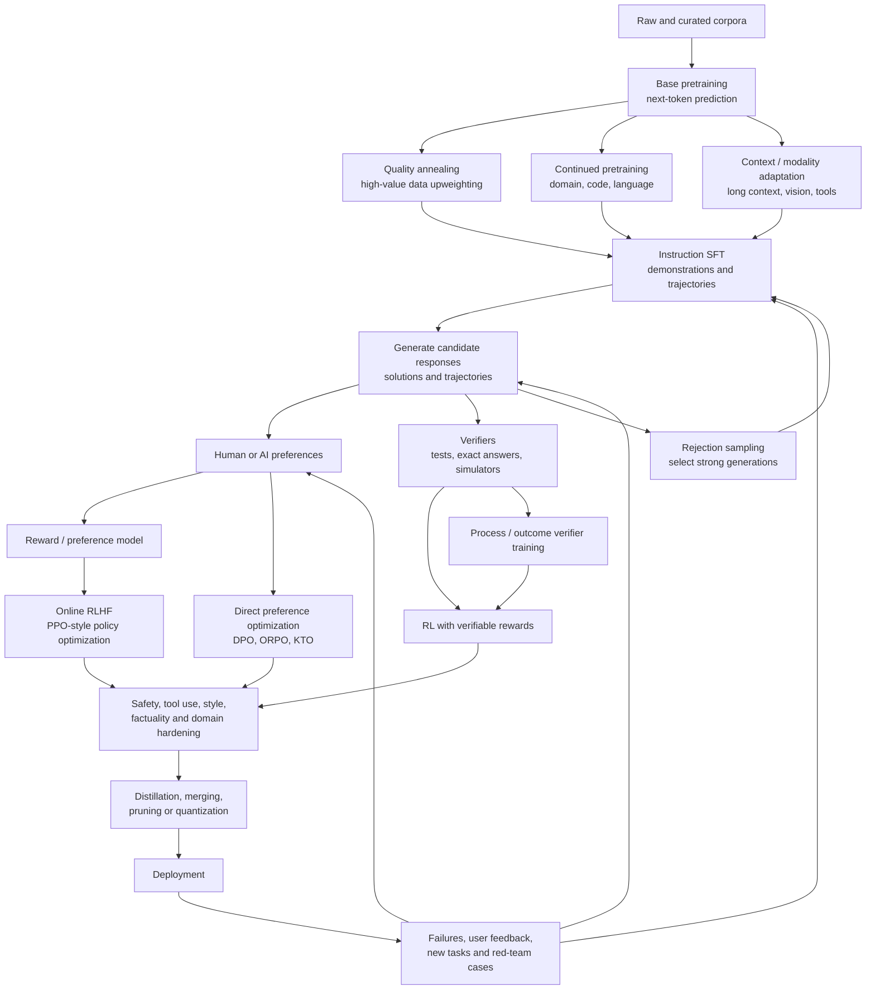

# A Stage-Theoretic View of Model Training

You are pointing at a deeper research object than “pretraining versus fine-tuning.” The right object is the **training program**: the sequence, branching structure, and feedback loops through which optimization signals progressively transform a model.

The architecture defines a hypothesis class—the set of functions the model could represent. The training program determines **which function inside that class is actually reached**. Because neural optimization is path-dependent, the same architecture, data, and even total compute can produce different final models depending on the order in which training signals are applied.

The familiar public InstructGPT recipe illustrates this. It begins with a pretrained GPT model, performs supervised fine-tuning on demonstrations, trains a separate reward model from response rankings, and then optimizes the language model with PPO. That can be described as “pretraining plus RLHF,” but it is already three target-model optimization regimes, one auxiliary-model training regime, and multiple data-collection regimes. ([arXiv][1])

The central thesis is:

> **Model capability is determined less by the nominal number of stages than by the topology, information content, dependencies, and interactions of those stages.**

---

## 1. What exactly counts as a training stage?

Without a formal definition, stage count is arbitrary. You could call an entire 15-trillion-token run one stage, or declare every checkpoint, learning-rate change, and data-mix adjustment a new stage.

A useful definition is:

> A training stage is a contiguous optimization regime in which the data distribution, objective, supervision source, trainable parameter set, architecture, optimization schedule, and evaluator remain approximately stationary.

Represent stage (k) as

[
S_k =
\left(
\mathcal D_k,
\mathcal L_k,
\Sigma_k,
\Theta_k,
\mathcal H_k,
\mathcal A_k,
\mathcal E_k
\right),
]

where:

* (\mathcal D_k) is the training-data distribution;
* (\mathcal L_k) is the optimization objective;
* (\Sigma_k) is the supervision source: tokens, demonstrations, preferences, rewards, verifiers, or environment outcomes;
* (\Theta_k) is the subset of trainable parameters;
* (\mathcal H_k) contains learning rate, batch size, sequence length, optimizer state, and regularization;
* (\mathcal A_k) contains auxiliary teachers, reward models, critics, or verifiers;
* (\mathcal E_k) is the evaluation and stopping rule.

The model update is then

[
\theta_{k+1}
============

\mathcal U_{S_k}(\theta_k).
]

A meaningful stage boundary occurs when at least one component changes enough to alter the geometry or meaning of the gradients.

### There are several different stage counts

You should distinguish at least five quantities:

| Count                     | Meaning                                                                     |
| ------------------------- | --------------------------------------------------------------------------- |
| **Macro-stage count**     | Broad categories such as pretraining, mid-training, and post-training       |
| **Policy-stage count**    | Separate optimization runs that update the deployed language model          |
| **Auxiliary-stage count** | Reward-model, verifier, critic, teacher, router, or filter training         |
| **Data-stage count**      | Generation, labeling, rejection sampling, filtering, and red-teaming cycles |
| **Iteration count**       | How many times the system repeats a feedback loop using a newer policy      |

A recipe can therefore be “two-stage” macroscopically while containing dozens of effective policy, data, and auxiliary stages.

## The Llama 3 counting paradox

Meta describes foundation-model development as two main stages: pretraining and post-training. But its disclosed recipe divides pretraining into initial pretraining, long-context pretraining, and annealing. Long-context adaptation itself proceeds through six incremental context-length stages. Post-training then applies six iterative rounds, each involving SFT and DPO, together with reward modeling, rejection sampling, synthetic-data generation, and model averaging. ([ar5iv][2])

Under different accounting systems, the same model is therefore:

* **2 stages:** pretraining and post-training;
* **15 policy phases:** 3 pretraining phases plus (6\times2) SFT/DPO phases;
* **approximately 20 micro-phases:** initial pretraining, 6 context expansions, annealing, and 12 post-training phases;
* **20-plus pipeline stages:** once reward modeling, data generation, rejection sampling, filtering, and evaluation are counted.

None of these descriptions is necessarily wrong. They answer different questions.

---

# 2. The model-development pipeline is a graph, not a line

Modern training is better represented as a directed graph with recurrent feedback than as

[
\text{pretraining}\rightarrow\text{fine-tuning}\rightarrow\text{done}.
]



This graph has four important structural properties:

1. **Depth:** the longest dependent sequence of model updates.
2. **Breadth:** parallel experts, reward models, verifiers, and data generators.
3. **Recurrence:** the number of generate–evaluate–retrain loops.
4. **Lineage:** upstream teachers and models whose knowledge has been compiled into the current dataset.

A more meaningful description of a training program is therefore not a scalar stage count (N), but a profile such as

[
\mathcal C_{\text{program}}
===========================

(\text{depth},\text{breadth},\text{recurrence},\text{objective heterogeneity},\text{lineage depth}).
]

---

# 3. The supervision ladder

Training stages differ primarily in the **kind of information their gradients contain**.

| Signal              | Example                        |             Coverage | Task specificity |     Credit assignment | Primary effect                              |
| ------------------- | ------------------------------ | -------------------: | ---------------: | --------------------: | ------------------------------------------- |
| Raw next tokens     | Web, books, code               |      Extremely broad |              Low |           Token-level | Language, knowledge, representations        |
| Curated next tokens | Textbooks, filtered code       |                Broad |         Moderate |           Token-level | More efficient capability acquisition       |
| Demonstrations      | Prompt–answer pairs            |             Narrower |             High | Token-level imitation | Instruction following and task format       |
| Preferences         | Chosen vs. rejected answer     |               Narrow |        Very high |     Sequence-relative | Style, helpfulness, safety, quality ranking |
| Verifiable outcomes | Unit tests, exact math answers |       Domain-limited |        Very high |      Sequence outcome | Discovery of successful strategies          |
| Process labels      | Step correctness               | Narrow and expensive |        Very high |            Step-level | Reasoning-path shaping                      |
| Environment reward  | Tool use, agents, games        |    Potentially broad |    Goal-specific |          Long-horizon | Interactive policy learning                 |

The crucial distinction is not simply “more versus fewer tokens.” It is the **mutual information between the supervision and the behavior you ultimately want**.

Raw pretraining gives a target at nearly every token, so it is technically dense supervision. But much of that supervision has weak alignment with “be a reliable assistant that follows this user’s intent.” A preference pair may carry only a small amount of explicit ordinal information, yet that information is highly concentrated on the desired behavior boundary.

A useful conceptual quantity is

[
B_k
\propto
N_k
\cdot
I(\Sigma_k;Y^\star\mid\theta_k)
\cdot
\rho_k,
]

where:

* (N_k) is the amount of supervision;
* (I(\Sigma_k;Y^\star\mid\theta_k)) is how informative it is about the desired behavior;
* (\rho_k) is how effectively the objective converts that signal into the correct gradient.

This is why a small post-training dataset can radically alter observable behavior after massive pretraining.

LIMA, for example, fine-tuned a 65B pretrained LLaMA model on only 1,000 carefully curated prompt–response pairs without reinforcement learning and obtained strong instruction-following behavior. That supports the view that much of the latent capability was already present and that the final stage primarily taught the model how to expose it in a useful interaction format. It was nevertheless still a **pretraining-plus-SFT** pipeline, not one-stage training from scratch. ([arXiv][3])

---

# 4. Pretraining and SFT can use the same loss and still be different stages

Base pretraining usually minimizes

[
\mathcal L_{\text{PT}}
======================

-\mathbb E_{x\sim\mathcal D_{\text{corpus}}}
\left[
\sum_t
\log p_\theta(x_t\mid x_{<t})
\right].
]

Instruction SFT usually minimizes

[
\mathcal L_{\text{SFT}}
=======================

-\mathbb E_{(u,y)\sim\mathcal D_{\text{instruction}}}
\left[
\sum_t
\log p_\theta(y_t\mid u,y_{<t})
\right],
]

often masking the loss over the user prompt and scoring only the assistant response.

Mathematically, both are next-token cross-entropy. Semantically, however, they optimize different conditional distributions:

[
\text{pretraining: }p_\theta(\text{text})
]

versus

[
\text{instruction tuning: }\pi_\theta(\text{assistant response}\mid\text{user request}).
]

This is why classifying stages only by their loss function is inadequate. The data distribution, role structure, masking, chat protocol, and desired conditional behavior may matter more than whether the implementation calls `CrossEntropyLoss`.

Preference optimization introduces a different signal. DPO, for example, directly increases the relative probability of a preferred completion over a rejected completion while remaining close to a reference policy:

[
\mathcal L_{\text{DPO}}
=======================

-\mathbb E
\log \sigma
\left(
\beta
\left[
\log\frac{\pi_\theta(y^+\mid x)}
{\pi_{\text{ref}}(y^+\mid x)}
-----------------------------

\log\frac{\pi_\theta(y^-\mid x)}
{\pi_{\text{ref}}(y^-\mid x)}
\right]
\right).
]

DPO was designed to replace the explicit reward-model-plus-online-RL portion of classical RLHF with a simpler supervised preference objective. It therefore **compresses algorithmic stages**, but it does not eliminate the need for preference-data generation. ([arXiv][4])

RL-style training instead optimizes something like

[
J_{\text{RL}}(\theta)
=====================

\mathbb E_{\tau\sim\pi_\theta}
[R(\tau)]
---------

\beta
D_{\mathrm{KL}}
\left(
\pi_\theta\Vert\pi_{\text{ref}}
\right).
]

Unlike SFT, this does not prescribe the exact desired trajectory. It lets the model explore trajectories and reinforces those that obtain high reward.

---

# 5. A more precise model of observed performance

A useful approximation is to decompose observable model performance into four interacting components:

[
P_{\text{observed}}
===================

F
\left(
C_{\text{latent}},
E_{\text{elicitation}},
Q_{\text{policy}},
V_{\text{verification}},
S_{\text{system}}
\right),
]

where:

* (C_{\text{latent}}): knowledge, representations, and skills stored in the weights;
* (E_{\text{elicitation}}): whether instructions reliably activate the relevant capability;
* (Q_{\text{policy}}): whether the model selects helpful, safe, concise, truthful outputs;
* (V_{\text{verification}}): whether it can check and repair its reasoning;
* (S_{\text{system}}): tool access, retrieval, inference-time search, memory, and scaffolding.

Different stages target different components.

| Stage                              | Dominant contribution                                                 |
| ---------------------------------- | --------------------------------------------------------------------- |
| Broad pretraining                  | (C_{\text{latent}})                                                   |
| High-quality or domain pretraining | Specific regions of (C_{\text{latent}})                               |
| Instruction SFT                    | (E_{\text{elicitation}}) and output protocol                          |
| Preference optimization            | (Q_{\text{policy}})                                                   |
| Reasoning RL / RLVR                | Search strategy, exploration, and sometimes (V_{\text{verification}}) |
| Process verifier training          | (V_{\text{verification}})                                             |
| Tool-use tuning                    | (S_{\text{system}}) and interface policy                              |
| Distillation                       | Compressing several components into a smaller model                   |

This decomposition is not absolute. Modern post-training can genuinely improve reasoning capabilities, while instruction-like supervision can be inserted during pretraining.

DeepSeek-R1-Zero showed that direct large-scale RL on a pretrained base model could produce long reasoning, reflection, and self-verification behaviors without an SFT cold start. But it also produced readability and language-mixing problems. DeepSeek-R1 consequently used a four-phase post-training path: cold-start SFT, reasoning RL, rejection-sampled SFT, and a second broader RL stage. ([arXiv][5])

That is an excellent example of two stages having different functions:

* RL discovered useful reasoning strategies.
* SFT regularized those strategies into a readable and usable interface.

---

# 6. Why sequential stages are not equivalent to one mixed stage

Suppose stage (A) is pretraining and stage (B) is instruction tuning.

Sequential training produces

[
\theta_{AB}
===========

\mathcal U_B
\left(
\mathcal U_A(\theta_0)
\right).
]

Reversing the order produces

[
\theta_{BA}
===========

\mathcal U_A
\left(
\mathcal U_B(\theta_0)
\right).
]

In general,

[
\theta_{AB}\neq\theta_{BA}.
]

The update operators do not commute:

[
[\mathcal U_A,\mathcal U_B](\theta)
===================================

## \mathcal U_B(\mathcal U_A(\theta))

\mathcal U_A(\mathcal U_B(\theta))
\neq 0.
]

Nor is sequential training generally equivalent to training once on a fixed mixture:

[
\mathcal U_B\circ\mathcal U_A
\not\approx
\mathcal U_{\alpha A+(1-\alpha)B}.
]

There are several reasons.

### 6.1 Representation prerequisites

A highly specialized instruction example may be nearly useless to an untrained model. Once pretraining has established language, code, and world representations, that same example can efficiently redirect existing capabilities.

A demonstration such as “repair this concurrent memory leak” cannot teach language, operating systems, concurrency, debugging, and communication from scratch. It can, however, teach an already capable model **how to combine those abilities into an assistant policy**.

### 6.2 Gradient interference

Let

[
g_A=\nabla_\theta\mathcal L_A,
\qquad
g_B=\nabla_\theta\mathcal L_B.
]

If

[
g_A^\top g_B < 0,
]

the objectives interfere locally. Mixing them can cause one signal to cancel or dilute the other. Sequential stages allow the model to first enter a useful representational region and then optimize a narrower behavioral objective.

### 6.3 Scale mismatch

Pretraining may involve trillions of tokens and tiny per-token learning signals. Preference or safety data may be several orders of magnitude smaller but more targeted. Mixing the smaller dataset into pretraining at a low ratio may make it ineffective; upsampling it enough to matter may cause memorization or distortion.

### 6.4 Optimizer mismatch

The stages may need different:

* learning rates;
* sequence lengths;
* batch construction;
* regularization;
* parameter subsets;
* sampling temperatures;
* reference policies;
* stopping criteria.

Llama 3, for example, delayed long-context training because the attention cost grows with sequence length and then expanded context incrementally, rather than paying that cost throughout the full pretraining run. ([ar5iv][2])

### 6.5 The later data may not exist yet

This is perhaps the deepest reason.

A later-stage dataset is often a function of the current model:

[
\mathcal D_{k+1}
================

G(\theta_k).
]

Examples include:

* rankings of the current model’s outputs;
* failures found by red teaming the current model;
* rejection-sampled responses from the latest checkpoint;
* RL trajectories generated on-policy;
* problems near the current model’s capability boundary;
* corrections to newly discovered failure modes.

Llama 3 repeatedly generated synthetic data and candidate responses from its latest models during six post-training rounds. DeepSeek-R1 created new SFT data from an RL-trained checkpoint before beginning another training phase. Such data cannot be perfectly inserted into the initial pretraining corpus because it depends on a model that does not yet exist. ([ar5iv][2])

---

# 7. When can stages be collapsed?

Two stages (A) and (B) are good candidates for merging when:

1. (\mathcal D_B) is static and does not depend on the model produced by (A);
2. their gradients are mostly compatible;
3. (B) does not require capabilities that (A) must first establish;
4. the objectives use compatible sequence lengths and optimizer settings;
5. the desired data-mixture ratio is stable throughout training;
6. joint training does not obscure evaluation or regression attribution;
7. the merged objective retains the information contained in both original signals.

This is what methods such as ORPO attempt at the post-training level. ORPO combines imitation of preferred outputs with a penalty against disfavored outputs in a single monolithic fine-tuning objective, removing a separate preference-alignment phase. ([arXiv][6])

Instruction Pre-Training moves instruction-response supervision earlier by augmenting large corpora with synthetically generated tasks. Its experiments found that this improved base models, although the resulting models still benefited from subsequent instruction tuning. This suggests that stage boundaries can be **blurred and moved**, but not necessarily eliminated. ([arXiv][7])

Reinforcement Pre-Training pushes the boundary in another direction by reframing next-token prediction as a verifiable RL task. The initial work reported stronger next-token prediction and better initialization for later RL, although its experiments were primarily on a 14B reasoning model and mathematical documents rather than full general-domain pretraining from scratch. ([arXiv][8])

The emerging pattern is:

> **Pretraining, instruction learning, and reinforcement learning are not immutable chronological categories. They are families of information signals that can sometimes be moved, mixed, or compiled into one another.**

---

# 8. “One-stage training” has four different meanings

When someone claims a model was trained in one stage, determine which meaning they intend.

## 8.1 One optimizer run

The target model was updated continuously without resetting the optimizer or switching checkpoints.

It may still contain a changing curriculum, multiple data distributions, or a combined loss.

## 8.2 One objective family

The model used only cross-entropy, only preference optimization, or only RL.

The data distribution may nevertheless have changed dramatically.

## 8.3 One target-model stage

The final student was trained once, but its teacher, reward model, verifier, and synthetic dataset may have required many earlier stages.

## 8.4 One global learning lineage

No upstream model, teacher, reward model, generated dataset, or inherited checkpoint depended on previous training.

This is the strongest and rarest meaning.

## Stage compilation

A particularly important concept is **stage compilation**:

> A complicated upstream training process can be compiled into a dataset or teacher, allowing a downstream student to appear to learn in one stage.

Phi-1 used carefully filtered web data and synthetic textbook-like data generated with GPT-3.5, and it still included a later fine-tuning stage on coding exercises. The target model’s training was relatively compact, but some of the educational structure in its data came from an already sophisticated upstream model. ([arXiv][9])

Similarly, a smaller model distilled from DeepSeek-R1 may require only a supervised distillation phase, but the reasoning trajectories in its dataset were produced by a model that had undergone pretraining, SFT, multiple RL phases, and rejection-sampling cycles. ([arXiv][5])

Thus:

[
\text{local stage count}
\neq
\text{global lineage stage count}.
]

A one-stage student may be the endpoint of a many-stage civilization of models, humans, verifiers, and filters.

---

# 9. Public recipes viewed through this framework

| Recipe               | Target-model path                                                                                                          | Auxiliary or data stages                                                              | Interpretation                                                                                                 |
| -------------------- | -------------------------------------------------------------------------------------------------------------------------- | ------------------------------------------------------------------------------------- | -------------------------------------------------------------------------------------------------------------- |
| **LIMA**             | Pretrained model (\rightarrow) 1,000-example SFT                                                                           | Human-curated demonstrations                                                          | Post-training can be shallow when the base is strong, but it is still a second stage. ([arXiv][3])             |
| **InstructGPT**      | Pretraining (\rightarrow) SFT (\rightarrow) PPO                                                                            | Demonstrations, rankings, reward-model training                                       | “RLHF” is a multi-model ecosystem, not one update. ([arXiv][1])                                                |
| **DPO**              | Pretraining/SFT (\rightarrow) preference optimization                                                                      | Preference-pair collection                                                            | Collapses explicit reward modeling and online RL into an offline objective. ([arXiv][4])                       |
| **ORPO**             | Pretrained base (\rightarrow) joint SFT/preference stage                                                                   | Preferred and rejected completions                                                    | Merges two post-training objectives into one optimizer phase. ([arXiv][6])                                     |
| **Tülu 3**           | Base (\rightarrow) SFT (\rightarrow) DPO (\rightarrow) RLVR                                                                | Synthetic instruction data, on-policy preferences, verifiers                          | Distinct signals are deliberately stacked to improve different capabilities. ([arXiv][10])                     |
| **Llama 3**          | Initial PT (\rightarrow) long-context PT (\rightarrow) annealing (\rightarrow [\text{SFT}\rightarrow\text{DPO}]_{\times6}) | Reward models, rejection sampling, synthetic data, human preferences, model averaging | Two macro-stages conceal roughly 15–20-plus effective phases. ([ar5iv][2])                                     |
| **DeepSeek-R1-Zero** | Pretrained base (\rightarrow) reasoning RL                                                                                 | Verifiable rewards                                                                    | Demonstrates that SFT is not logically required before reasoning RL. ([arXiv][5])                              |
| **DeepSeek-R1**      | Base (\rightarrow) cold-start SFT (\rightarrow) RL (\rightarrow) regenerated SFT (\rightarrow) broader RL                  | Rejection sampling, verification, distillation                                        | Alternates discovery and regularization rather than treating SFT and RL as a one-way progression. ([arXiv][5]) |

The table reveals that stages are not simply “more polish.” They can play fundamentally different computational roles:

* constructing representations;
* establishing an action vocabulary;
* eliciting latent competence;
* exploring new strategies;
* selecting among strategies;
* compressing discovered behavior;
* correcting deployment failures.

---

# 10. Could there be infinitely many training stages?

Mathematically, yes.

Let the complete training state be

[
X_k =
\left(
\theta_k,
\phi_k,
\mathcal D_k,
\mathcal E_k
\right),
]

where:

* (\theta_k) is the policy model;
* (\phi_k) contains reward models, verifiers, and teachers;
* (\mathcal D_k) is the current dataset;
* (\mathcal E_k) is the evaluation environment.

An iterative model-development system is a dynamical system:

[
X_{k+1}
=

\mathcal T_k(X_k).
]

Each iteration may:

1. deploy or evaluate (\theta_k);
2. discover failures;
3. generate new examples;
4. retrain a verifier or reward model;
5. update the policy;
6. repeat.

As (k\rightarrow\infty), this becomes continual learning or an online self-improvement process rather than a finite training pipeline.

However, infinite stages do not imply infinite improvement.

## 10.1 Diminishing returns

Later iterations increasingly target narrower residual errors. An iterated-RLHF study found that repeated reward-model and policy updates could reduce overoptimization, but gains diminished over successive iterations. ([arXiv][11])

## 10.2 Catastrophic forgetting

Sequential fine-tuning can improve the current target while degrading previously learned knowledge, reasoning, or instruction-following behavior. Empirical work has observed catastrophic forgetting during continual instruction tuning across billion-parameter language models. ([arXiv][12])

## 10.3 Reward overoptimization

A model can increasingly optimize the proxy reward while actual human-perceived quality plateaus or declines. This also appears in direct alignment methods such as DPO-like objectives, even without a separately trained reward model. ([arXiv][13])

## 10.4 Distributional feedback

As the policy changes, old preference data becomes off-policy. New data may overrepresent current weaknesses while underrepresenting previously solved capabilities.

## 10.5 Self-generated-data collapse

Repeatedly training only on a model’s own outputs can narrow diversity and reinforce systematic errors unless grounded by external data, verification, adversarial generation, or preserved replay data.

The goal is therefore not to maximize stage count. It is to stop when the **marginal robust utility** of another stage is no longer positive.

A practical acceptance rule is

[
\operatorname{Accept}(S_k)
\iff
\begin{cases}
\Delta U_{\text{held-out}} > \delta,\
-\Delta M_j \leq \epsilon_j\quad\forall j,\
\text{gain survives evaluator changes},\
\text{gain survives distribution shifts},\
\text{cost and risk remain acceptable}.
\end{cases}
]

A stage should be accepted because it improves a Pareto frontier—not merely because its training loss or reward increased.

---

# 11. The most important research object: the stage-transfer matrix

For a model with capabilities (M_1,\ldots,M_m), record the effect of every stage:

[
T_{k,j}
=

M_j(\theta_k)-M_j(\theta_{k-1}).
]

This produces a stage-transfer matrix:

[
T=
\begin{bmatrix}
\Delta\text{knowledge} &
\Delta\text{reasoning} &
\Delta\text{instruction} &
\Delta\text{safety} &
\Delta\text{coding}\
\vdots & \vdots & \vdots & \vdots & \vdots
\end{bmatrix}.
]

A row tells you what a stage changed. A column tells you which stages created, preserved, or damaged a capability.

From this, define:

### Stage efficiency

[
E_k
=

\frac{
\mathbf w^\top T_k
}{
\text{FLOPs}_k
}.
]

### Retention-adjusted stage value

[
V_k
=

\sum_j w_j\max(T_{k,j},0)
-
\lambda
\sum_j v_j\max(-T_{k,j},0).
]

### Path sensitivity

For stages (A) and (B),

[
P_{A,B}
=

\left|
M!\left(\mathcal U_B\circ\mathcal U_A(\theta_0)\right)
-
M!\left(\mathcal U_A\circ\mathcal U_B(\theta_0)\right)
\right|.
]

### Mergeability

[
C_{A,B}
=

\left|
M!\left(\mathcal U_B\circ\mathcal U_A(\theta_0)\right)
-
M!\left(\mathcal U_{A\cup B}(\theta_0)\right)
\right|.
]

Low (C_{A,B}) means the stages can probably be collapsed. High (C_{A,B}) means sequential structure is doing meaningful work.

This converts your line of thought from informal recipe comparison into a measurable research program.

---

# 12. A concrete experiment for your software-maintainer model

Your 100M–1B software-maintainer project is an ideal setting because code provides automatic verifiers: compilation, unit tests, type checking, linters, repository tests, and execution traces.

Start from the same initialization and equalize total training compute as closely as possible.

| Pipeline              | Training program                                                                                                                        | Hypothesis                                                         |
| --------------------- | --------------------------------------------------------------------------------------------------------------------------------------- | ------------------------------------------------------------------ |
| **A: Monolithic**     | Mix repository text, issue–patch pairs, tool traces, and preferred patches from the beginning                                           | Tests whether high-quality data can collapse stages                |
| **B: Sequential SFT** | Repository pretraining (\rightarrow) supervised maintenance trajectories                                                                | Measures the value of representation-first training                |
| **C: Preference**     | Pretraining (\rightarrow) SFT (\rightarrow) DPO on successful vs. unsuccessful patches                                                  | Tests whether relative supervision improves patch selection        |
| **D: Verifiable RL**  | Pretraining (\rightarrow) SFT (\rightarrow) RLVR using tests and static analysis                                                        | Tests discovery beyond imitation                                   |
| **E: Iterative**      | Pretraining (\rightarrow) SFT (\rightarrow) generate failures (\rightarrow) verify (\rightarrow) retrain, repeated three or more rounds | Measures feedback-loop value and diminishing returns               |
| **F: Stage-compiled** | Distill verified trajectories from Pipeline E into the original base in one supervised run                                              | Measures local one-stage training versus global lineage complexity |

Evaluate every checkpoint on the same capability vector:

[
M(\theta)=
\begin{bmatrix}
\text{completion perplexity}\
\text{compile rate}\
\text{unit-test pass rate}\
\text{repository repair rate}\
\text{tool-call validity}\
\text{instruction adherence}\
\text{regression rate}\
\text{calibration}\
\text{patch minimality}\
\text{unseen-repository transfer}
\end{bmatrix}.
]

Also record:

* gradient cosine similarity between objectives;
* KL divergence from the base policy;
* weight-delta norms by layer;
* old-task retention after each stage;
* fraction of on-policy versus stale data;
* verifier false-positive rate;
* performance per training FLOP;
* performance per newly labeled example;
* differences between sequential and mixed training.

The most revealing comparison will likely be:

[
\text{monolithic mixture}
\quad\text{vs.}\quad
\text{sequential stages}
\quad\text{vs.}\quad
\text{stage-compiled distillation}.
]

That separates three hypotheses:

1. stages are merely an engineering convenience;
2. stage order creates genuinely better representations;
3. stages can be compressed into data only after an upstream model has discovered the behavior.

---

# 13. A training-stage ledger

Every experiment should have a standardized record like this:

```yaml
stage_id: maintainer_rlvr_round_02
parent_checkpoint: maintainer_sft_v1
model_role: policy
objective: verifiable_reward_optimization

data:
  source: on_policy_repository_repairs
  size: 120000_trajectories
  domains:
    - bug_fixing
    - test_generation
    - dependency_updates
  policy_dependence: true
  generating_checkpoint: maintainer_sft_v1

supervision:
  type: outcome_reward
  verifiers:
    - compiler
    - unit_tests
    - static_type_checker
    - linter

optimization:
  trainable_parameters: full_model
  context_length: 16384
  learning_rate: 1.0e-6
  rollout_budget: 8_per_problem
  reference_policy: maintainer_sft_v1

expected_effects:
  positive:
    - repair_success
    - test_awareness
    - multi_step_search
  risks:
    - reward_hacking
    - overly_large_patches
    - regression_on_explanation_quality

acceptance:
  minimum_repair_gain: 0.03
  maximum_old_task_regression: 0.01
  maximum_verifier_false_positive_rate: 0.005
```

The ledger makes stages scientifically comparable and prevents “we added another tuning pass and the benchmark went up” from being mistaken for a causal explanation.

---

# 14. Canonical reading sequence

| Topic                            | Primary reading                                                 | Question to extract                                                                                       |
| -------------------------------- | --------------------------------------------------------------- | --------------------------------------------------------------------------------------------------------- |
| Public alignment pipeline        | **InstructGPT**                                                 | Why demonstrations, reward modeling, and policy optimization were separated ([arXiv][1])                  |
| High-quality pretraining         | **Textbooks Are All You Need**                                  | How data quality changes the required scale and downstream adaptation ([arXiv][9])                        |
| Shallow alignment                | **LIMA**                                                        | How much behavior can be elicited from a strong base with very little SFT ([arXiv][3])                    |
| Preference-stage compression     | **DPO** and **ORPO**                                            | Which RLHF stages can be rewritten as supervised objectives ([arXiv][4])                                  |
| Full modern open recipe          | **Tülu 3**                                                      | How SFT, preferences, and verifiable rewards interact ([arXiv][10])                                       |
| Fine-grained industrial staging  | **Llama 3 Herd**                                                | How curricula, long context, synthetic data, and repeated post-training rounds are organized ([ar5iv][2]) |
| Reasoning-stage discovery        | **DeepSeek-R1**                                                 | What RL can discover, what SFT regularizes, and why the stages alternate ([arXiv][5])                     |
| Moving supervision earlier       | **Instruction Pre-Training** and **Reinforcement Pre-Training** | Whether traditional stage boundaries can be moved into pretraining ([arXiv][7])                           |
| Failure modes of repeated stages | Reward overoptimization and catastrophic forgetting studies     | Why additional stages can eventually reduce real performance ([arXiv][13])                                |

---

# The central expert framework

The deepest way to think about this is:

[
\boxed{
\text{Training is the progressive conversion of broad statistical capacity into a controlled policy.}
}
]

Pretraining creates a large space of latent behaviors. Instruction tuning makes useful regions accessible. Preference optimization changes which accessible behaviors are selected. Reinforcement learning allows exploration beyond demonstrated trajectories. Verification distinguishes merely plausible behavior from successful behavior. Distillation compiles the resulting policy into a smaller or simpler model. Deployment produces the failures that define the next training distribution.

Therefore:

[
\boxed{
\text{More stages are useful when each stage creates information required by the next.}
}
]

And:

[
\boxed{
\text{Stages can be collapsed when their data are static, objectives compatible, and update operators approximately commute.}
}
]

The most important distinction is not one-stage versus ten-stage training. It is:

[
\boxed{
\text{static supervision}
\quad\text{versus}\quad
\text{policy-dependent, recursively generated supervision}.
}
]

Once the training data depend on what the current model can do, model development naturally becomes an iterative dynamical system. That is where “infinite stages” stops being rhetorical and becomes the theory of continual, self-improving model training.

[1]: https://arxiv.org/abs/2203.02155 "https://arxiv.org/abs/2203.02155"
[2]: https://ar5iv.labs.arxiv.org/html/2407.21783 "https://ar5iv.labs.arxiv.org/html/2407.21783"
[3]: https://arxiv.org/abs/2305.11206 "https://arxiv.org/abs/2305.11206"
[4]: https://arxiv.org/abs/2305.18290 "https://arxiv.org/abs/2305.18290"
[5]: https://arxiv.org/html/2501.12948v1 "https://arxiv.org/html/2501.12948v1"
[6]: https://arxiv.org/abs/2403.07691 "https://arxiv.org/abs/2403.07691"
[7]: https://arxiv.org/abs/2406.14491 "https://arxiv.org/abs/2406.14491"
[8]: https://arxiv.org/html/2506.08007v1 "https://arxiv.org/html/2506.08007v1"
[9]: https://arxiv.org/abs/2306.11644 "https://arxiv.org/abs/2306.11644"
[10]: https://arxiv.org/html/2411.15124v1 "https://arxiv.org/html/2411.15124v1"
[11]: https://arxiv.org/html/2505.18126v1 "https://arxiv.org/html/2505.18126v1"
[12]: https://arxiv.org/abs/2308.08747 "https://arxiv.org/abs/2308.08747"
[13]: https://arxiv.org/abs/2406.02900 "https://arxiv.org/abs/2406.02900"
